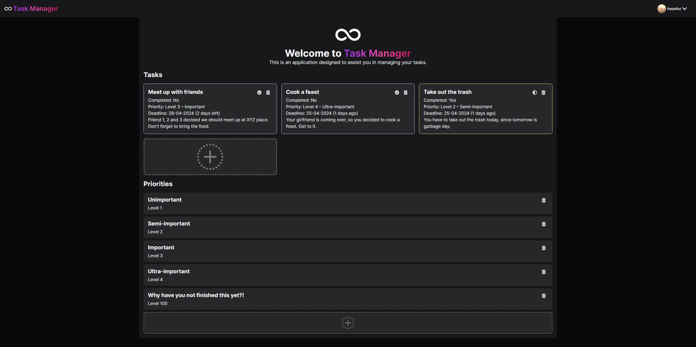

# Task Manager

Task Manager is an application designed to assist you in managing your tasks.



## Getting started

### Prerequisites

- [Node.js](https://nodejs.org/en/) >= 18.0.0
- [yarn](https://yarnpkg.com/getting-started) >= 1.22.22
- [PostgreSQL](https://www.postgresql.org/)

### Installation

1. Clone the repo

```
git clone https://github.com/LordHarkon/task-manager
```

2. Install dependencies

```
yarn
```

### Setup

1. Copy `.env.example` to `.env`

```
cp .env.example .env
```

2. Fill the environment variables
3. Push the schema into the database

```
yarn db:push
```

### Usage

1. Start the development server

```
yarn dev
```
